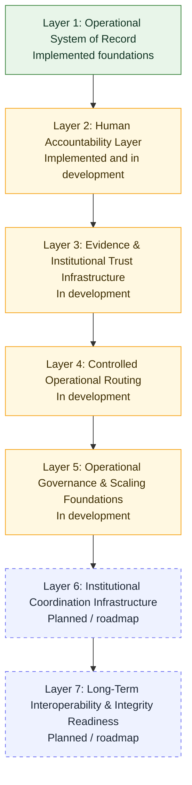

# RentChain Architecture

RentChain is governed rental operations and property intelligence infrastructure. Its architecture combines product workflows, audit continuity, projection-safe read models, metadata-first evidence, and supervised operational review.

For implementation workflow, repository discovery, and mission execution rules, follow `AGENTS.md`, `PROCESS.md`, `codex.md`, and `docs/execution/AI_COWORK_PROTOCOL.md`.

For shared governance terminology, use `docs/ai/claude-context/GOVERNANCE_REFERENCE.md`.

## Architecture Diagram Maturity Legend

The architecture map is an operational evolution map, not a guaranteed live production state map. It intentionally shows implemented foundations, in-development hardening, and planned roadmap layers together so engineering, QA, Claude, and strategic reviewers can reason about sequence.

Use this maturity legend whenever architecture diagrams or maps are shared:

- **Implemented**: materially present in current code, routes, docs, tests, or shipped UI surfaces. Implementation depth may still vary by feature.
- **In Development**: active foundation or hardening area with partial helpers, read models, tests, docs, or preview surfaces, but not complete workflow execution.
- **Planned / Roadmap**: strategic direction only. Requires future scoped missions, governance review, tests, QA, and deployment verification before it can be described as live.



Projection-safety notation for this map:

- tenant, landlord, admin/support, export, dashboard, timeline, and debug surfaces are separate visibility contexts
- user-facing reads must be projection-safe and audience-scoped
- consent-governed sharing is required before external or institution-facing use
- roadmap layers must not imply raw payload access, live government/payment rails, or autonomous escalation

## Architecture-to-Mission Phase Mapping

The architecture layers map to the mission phases in `docs/ai/claude-context/CURRENT_ACTIVE_MISSIONS.md`. This mapping is a planning and review aid, not a guarantee that every layer is fully implemented.

| Architecture layer | Closest mission phase | Current maturity | Governance risk level | Interpretation |
| --- | --- | --- | --- | --- |
| Layer 1 — Operational System of Record | Phase 2 — Tenant & Operational Continuity Foundations | Implemented foundations / in development | Medium | Core landlord, tenant, lease, message, document, maintenance, application, and portfolio surfaces exist, but each workflow still needs scoped QA before stronger production claims. |
| Layer 2 — Human Accountability Layer | Phase 3 — Governed Review Workspace Hardening | Implemented and in development | High | Security incident, support escalation, and review workspace surfaces are review-first foundations. They must not be described as autonomous workflow execution. |
| Layer 3 — Evidence & Institutional Trust Infrastructure | Phase 5 — Evidence, Export & Institutional Trust | In development | High | Evidence, trust, and export readiness surfaces exist at varying depth. They remain metadata-first and consent-aware, not live external submissions or legal artifacts by default. |
| Layer 4 — Controlled Operational Routing | Phase 3 and Phase 4 — Review Workspace Hardening plus Security & Operational Hardening | In development | High | Routing means supervised triage and review continuity. It does not imply mutation, enforcement, remediation, or uncontrolled escalation. |
| Layer 5 — Operational Governance & Scaling Foundations | Phase 1, Phase 3, and Phase 4 — QA Infrastructure, Review Hardening, and Security Hardening | In development | Medium / High | Projection safety, read models, deployment verification, AI cowork process, mobile access, and route/access regression protection harden the platform before broader coordination. |
| Layer 6 — Institutional Coordination Infrastructure | Phase 6 — Institutional Coordination Readiness | Planned / roadmap | Very High | Subsidy/program, government, insurer, lender, auditor, institutional identity, and sharing-room coordination remain readiness concepts unless future missions verify specific implemented slices. |
| Layer 7 — Long-Term Interoperability & Integrity Readiness | Phase 7 — Long-Term Interoperability & Integrity Readiness | Planned / roadmap | Very High | Interoperability, selective integrity verification, settlement rail readiness, tokenization readiness, and portable evidence compatibility remain later-stage roadmap work. |

Use `docs/ai/claude-context/GOVERNANCE_REFERENCE.md` status labels when discussing this table:

- **Implemented** means the surface or foundation is materially present, not necessarily complete end-to-end workflow execution.
- **In Development** means the architecture area has partial helpers, read models, routes, docs, tests, or preview surfaces.
- **Planned / Roadmap** means a future scoped mission is required before describing it as live behavior.
- **Needs Verification** applies whenever a claim depends on deployed payloads, Cloud Run revision freshness, environment flags, external integration behavior, or representative QA.

## Runtime Deployment Model

- Vercel deploys `rentchain-frontend` as the client application and lightweight serverless functions under `rentchain-frontend/api/*`.
- Cloud Run serves `rentchain-api`, the Express API containing core product routes.
- Firestore is the primary database.
- Firebase Auth provides identity; server-side middleware enforces authorization.
- Google Cloud Storage is used where storage is required.
- Terraform, GitHub Actions, Vercel, and Google Cloud deployment checks form the delivery surface.

Frontend API calls must use the configured Cloud Run base URL through existing API helpers. A Vercel preview proves frontend freshness only; backend QA requires Cloud Run revision/image/traffic verification.

## Runtime Alignment Boundary

Current route inventory shows implemented surface area across public, landlord, tenant, contractor, admin, support, review-workspace, export/readiness, screening, billing/payment, maintenance, message, registry, audit, and observability workflows.

Use this distinction when reading architecture docs:

- **Mounted page or route**: the runtime surface exists.
- **Helper or read model**: an implementation foundation exists, but may still be metadata-only, read-only, test-only, or persistence-readiness only.
- **Readiness or observability page**: a governed review/readiness surface exists; it is not proof of live external integration.
- **Preview behavior**: requires Vercel and Cloud Run alignment checks before being treated as current deployed truth.

Do not upgrade a roadmap or readiness surface to a live production claim without checking source code, tests, authorization, representative payloads, and deployment revision.

## Layer 1 — Operational System of Record

This layer contains the operational rental workflows:

- properties, units, tenants, applications, leases, messages, documents, maintenance, and work orders
- portfolio and landlord operational views
- tenant portal profile, lease, document, message, and trust/export-facing views
- canonical events, decision summaries, review timelines, and workflow history where implemented

Principle: product objects and events are the operational truth. Do not replace them with duplicate state systems or unsupported inferred workflows.

## Layer 2 — Human Accountability Layer

This layer provides manual review and audit continuity:

- admin security incident review
- support escalation runbooks
- support escalation history and review note contracts
- admin support escalation review surface
- governed review workspace summaries and read routes
- impersonation actor-chain attribution and support/admin audit metadata

Maturity: implemented and in development. Current surfaces are review and read-model foundations, not full workflow execution engines. Review workspace write/persistence behavior beyond helper/adapter foundations needs separate mission evidence before it is described as production workflow execution.

Principle: review surfaces should be metadata-only, manual-review-first, and explicit about what they do not execute. No hidden approve, resolve, dismiss, remediate, impersonate, or enforcement behavior should be inferred.

## Layer 3 — Evidence & Institutional Trust Infrastructure

This layer prepares evidence and export readiness:

- projection-safe evidence references
- institution export previews
- institutional trust export frameworks
- consent-scoped tenant trust/export concepts
- identity, property, and account trust readiness models
- redaction summaries and provenance metadata

Maturity: in development. These foundations include implemented pages, routes, helpers, reports, and tests at varying depths. They support controlled review and readiness, not live institutional submissions or certification unless verified by a specific deployed route and payload.

Principle: institutional trust is metadata-first and policy-gated. Raw provider payloads, documents, screening reports, private message bodies, storage paths, credentials, tokens, and unrestricted policy internals must not leak into user-safe or external-facing payloads.

## Layer 4 — Controlled Operational Routing

This layer coordinates manual review and supervised escalation:

- security and support review routing
- escalation categories, severity, manual states, approval expectations, and safe refs
- route-source attribution for governance debugging
- operator review concepts
- human-reviewed, AI-assisted triage concepts
- controlled operational routing with supervised assistance

Maturity: in development. Routing concepts remain supervised and review-first.

Principle: routing is not automation. Escalation and review recommendations should not mutate records or trigger external effects unless a future mission explicitly adds safe, auditable controls.

## Layer 5 — Operational Governance & Scaling Foundations

This layer keeps the platform scalable and safe:

- projection safety helpers
- read models and sanitized summaries
- consent continuity
- workflow normalization
- mobile operational access
- deployment verification discipline
- AI cowork process governance

Principle: read models must remain audience-aware. Tenant, landlord, admin/support, export, dashboard, timeline, and debug contexts are separate surfaces with different visibility rules.

## Layer 6 — Institutional Coordination Infrastructure

This layer is planned / roadmap and should be treated carefully:

- rental subsidy and housing program coordination readiness
- lender, insurer, auditor, and government review workflows
- lifecycle continuity across leases, tenants, documents, and evidence
- institutional review rooms and invite flows
- legal/compliance readiness workflows
- future payments, settlement coordination, and disbursement readiness concepts
- inter-agency data-sharing readiness concepts

Maturity: planned / roadmap, generally Phase 6+ or later. Some readiness pages may exist, but they do not imply live welfare support, housing program, government, payment, disbursement, or inter-agency integrations.

Principle: institutional coordination requires consent, retention, authorization, redaction, and manual review. Do not claim live external integrations unless implementation and deployment prove them.

## Layer 7 — Long-Term Interoperability & Integrity Readiness

This layer is strategic and later-stage:

- selective integrity verification
- interoperability compatibility
- portable attestations
- external adapter standards
- evidence package signing or verification concepts
- future institutional handoff formats
- continuity portability and archival/export package concepts

Maturity: planned / roadmap, generally Phase 7+. It does not imply live regulated financial rails, compliance certification, identity provider integrations, or public interoperability commitments.

Principle: governance before interoperability. Integrity and interoperability layers should build on stable consent, projection, evidence, and review foundations.

## Identity, Compliance, and Payment Boundaries

Use careful terminology for identity, compliance, and payment-related architecture:

- Prefer **Tenant Identity Readiness** or **Identity Readiness Foundations** over compliance-grade KYC claims unless a future mission adds and verifies provider-backed identity verification.
- Prefer **Security & Audit Foundations** or **future compliance readiness** over SOC2 readiness unless formal compliance work is explicitly scoped and supported.
- Treat payments, disbursements, subsidy disbursement, and settlement coordination as future readiness concepts unless current code and deployment prove live regulated financial rail operation.
- Treat archival/export packages, portable tenant history, and continuity portability as evidence/export roadmap layers unless a specific implemented export surface supports them.

Government and support-related roadmap labels should remain explicitly planned:

- **Rental Subsidies**: planned / roadmap, Phase 6+ coordination readiness only.
- **Welfare Support**: planned / roadmap, Phase 6+ support coordination readiness only.
- **Housing Programs**: planned / roadmap, Phase 6+ program coordination readiness only.
- **Payments & Disbursements**: planned / roadmap, Phase 6+/7+ settlement coordination readiness only.
- **Inter-Agency Data Sharing**: planned / roadmap, Phase 7+ interoperability readiness only.
- **Archival/export packages and portable tenant history**: Phase 5+ evidence/export readiness unless an implemented tenant-safe export surface explicitly supports a narrower current capability.

## Strategic Architecture Principles

- Governance before interoperability.
- Supervised AI workflows, not autonomous enforcement.
- Append-safe operational continuity.
- Metadata-first institutional trust.
- Projection-safe reads for every audience.
- Controlled escalation routing.
- Institutional export safety and consent-aware evidence lineage.
- Firestore remains the primary database; do not introduce SQL or parallel persistence without a mission.
- Auth and authority-sensitive access resolve server-side, never from client assumptions.

## Canonical API Base

The frontend must call Cloud Run through `VITE_API_BASE_URL`, with requests resolving to:

```text
${VITE_API_BASE_URL}/api/...
```

Do not rely on `https://www.rentchain.ai/api/*` for core API calls; that host points to Vercel and can return 404 for Cloud Run routes.

## Deployment Verification

For frontend changes:

- Vercel preview should reflect the PR branch.
- Browser/network checks should confirm the frontend points at the intended API base.

For backend changes:

- confirm Cloud Run active revision
- confirm image tag or digest
- confirm revision timestamp
- confirm traffic is 100 percent to the expected revision
- verify the authenticated API payload or route-source header after deployment

If preview behavior disagrees with local tests, inspect deployment alignment before adding more code.

## Non-Goals

This architecture does not currently claim:

- autonomous AI remediation
- live lender/insurer/government integrations
- external institutional submission
- public trust profiles
- legal certification
- tokenization execution
- production-ready native app-store distribution

Those directions require future scoped missions, implementation evidence, and explicit operator approval.
