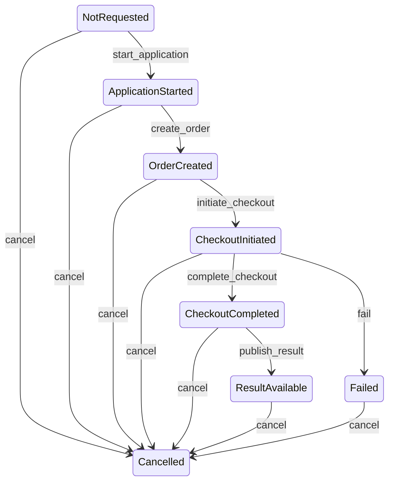
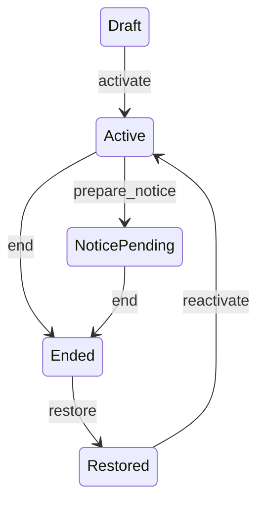
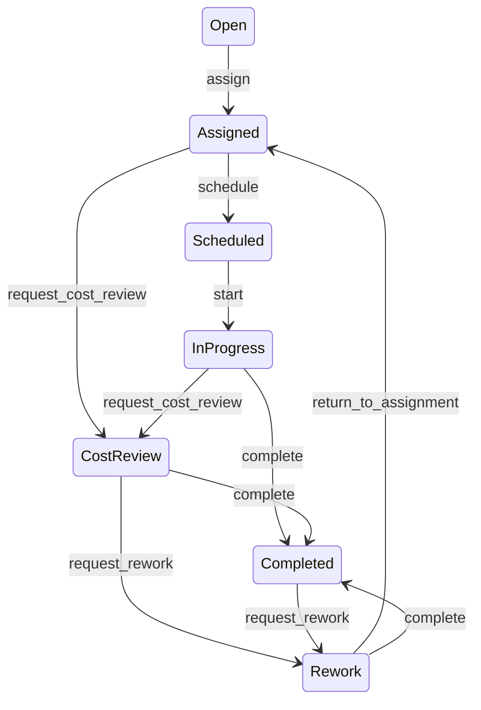
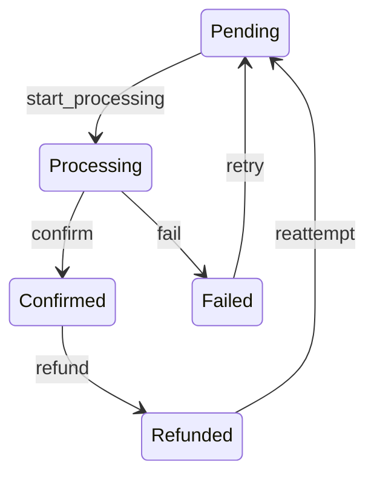
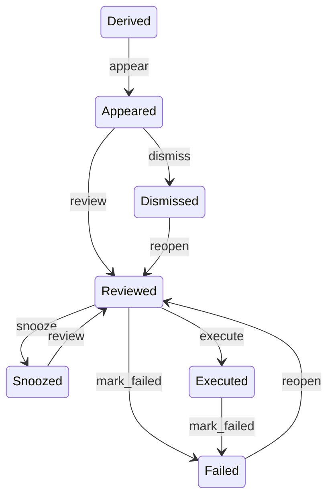

# State Machines V1

## Purpose

State Machines V1 defines deterministic review-state semantics for screening, lease, maintenance, payment, and decision workflows. The implementation is infrastructure-only for Phase 2 Mission 2: it computes state from existing records, validates proposed transitions, and adds advisory route markers without changing current route behavior.

## Shared Rules

- State computation is pure and uses existing persisted records.
- Validators return `{ valid, allowedTransitions, reason }` through a consistent public API.
- Validators fail closed when authority, current state, or required context is missing.
- No state machine definition is stored in Firestore.
- No transition enforcement is enabled in this mission.
- Browser-only form state remains distinct from persisted workflow state.
- State machine metadata is not added to tenant-facing exports, documents, or dashboards.

## Screening

| State | Meaning | Required context for forward transitions |
| --- | --- | --- |
| `NotRequested` | No application/order/payment/result state exists. | `applicationId`, `landlordId` |
| `ApplicationStarted` | Application state exists before an order. | `applicationId`, `orderId` |
| `OrderCreated` | Screening order exists before checkout. | `orderId`, `checkoutSessionId` |
| `CheckoutInitiated` | Checkout was created and is awaiting completion/failure. | `orderId`, payment result context |
| `CheckoutCompleted` | Payment is complete; result is not yet available. | `applicationId`, `resultId` |
| `ResultAvailable` | Screening result is available. | terminal for normal flow |
| `Failed` | Screening or payment failed. | terminal unless cancelled for administrative closure |
| `Cancelled` | Workflow was cancelled. | terminal |

Authority: landlord or admin context with explicit authorization.

Idempotency: repeated terminal transitions should be treated by caller services as no-op or invalid according to existing route behavior; the V1 validator only reports allowed next states.

Event continuity: screening events and transaction records remain the append-safe history source.

## Lease

| State | Meaning | Required context |
| --- | --- | --- |
| `Draft` | Draft or generated lease record before activation. | `leaseId`, `landlordId` |
| `Active` | Current active lease. | `leaseId`, `landlordId`; optional notice context |
| `NoticePending` | Lease notice or renewal workflow is pending. | `leaseId`, `landlordId`, `noticeId` |
| `Ended` | Lease was ended, expired, or terminated. | explicit restore context for reversal |
| `Restored` | Ended lease has been restored and can reactivate. | `leaseId`, `landlordId` |

Authority: landlord or admin context with explicit authorization.

Idempotency: direct `Ended -> Active` is invalid; restoration must pass through `Restored`.

Event continuity: lease status is mutable current state. Lease notices and selected lifecycle actions preserve append-safe workflow events.

## Maintenance

| State | Meaning | Required context |
| --- | --- | --- |
| `Open` | Submitted request not yet assigned. | `workOrderId`, `assignedContractorId` |
| `Assigned` | Contractor or operational owner is assigned. | schedule or cost context |
| `Scheduled` | Work is scheduled. | `workOrderId` |
| `InProgress` | Work has started. | cost or evidence context depending on transition |
| `CostReview` | Cost review is pending or revision/rejection is active. | `workOrderId`; cost approval context |
| `Completed` | Work is complete. | rework context if reopening |
| `Rework` | Rework cycle is active. | assignment or completion context |

Authority: landlord/admin for assignment and review; contractor/landlord/admin for schedule, start, cost submission, and completion; tenant/landlord/admin for rework request.

Idempotency: repeated completion should be handled by caller services using existing work order history. V1 reports valid next states only.

Event continuity: status history, cost review history, rework history, and work order updates remain the append-safe evidence source.

## Payment

| State | Meaning | Required context |
| --- | --- | --- |
| `Pending` | Payment exists or is ready for processing. | `paymentId`, `paymentIntentId` |
| `Processing` | Checkout or payment is awaiting confirmation/failure. | persisted transaction status |
| `Confirmed` | Payment is recorded as paid, confirmed, completed, or recorded. | refund context for reversal |
| `Failed` | Payment failed, expired, or was cancelled. | retry context |
| `Refunded` | Payment has been refunded. | reattempt context |

Authority: authenticated tenant, landlord, admin, or system context depending on caller surface.

Idempotency: final-state protection remains in existing payment services. V1 does not call external payment APIs.

Event continuity: payment events and payment intent events remain the append-safe evidence source.

## Decision

| State | Meaning | Required context |
| --- | --- | --- |
| `Derived` | Decision exists only as a derived read model. | `decisionId`, `landlordId`, valid source |
| `Appeared` | Decision appearance has been recorded or action state has started. | review or dismissal context |
| `Reviewed` | Operator reviewed the decision. | action record for downstream action |
| `Snoozed` | Decision is deferred until a future time. | `snoozedUntil` |
| `Dismissed` | Decision was dismissed and can be reopened. | action record |
| `Executed` | Decision action was executed. | failure context if operation fails |
| `Failed` | Execution failed and can be reopened for review. | valid source |

Authority: landlord or admin context with explicit authorization and ownership.

Idempotency: decision appearance is append-safe through canonical events. Action state remains a current-state record until a future mission extends event emission.

## Error Cases

| Error | Meaning | Expected caller behavior |
| --- | --- | --- |
| `invalid_transition` | Proposed state is not allowed from current state. | Return or log clear validation reason; do not mutate state. |
| `insufficient_authority` | Actor context is missing or role is not allowed. | Fail closed in enforcing callers. Advisory markers log only. |
| `missing_context` | Required identifiers or transition fields are absent. | Request more context before attempting mutation. |
| `ambiguous_state` | Persisted state is not enough to safely validate the transition. | Keep existing behavior in Phase 2; enforce later only with explicit migration plan. |
| `terminal_state` | Terminal workflow state cannot proceed. | Treat as no-op or error according to existing route contract. |
| `source_invalid` | Source decision or workflow context is stale or invalid. | Refresh source model before attempting action. |

## Integration Points

Implemented in this mission:

- `rentchain-api/src/services/stateMachines/types.ts`
- `rentchain-api/src/services/stateMachines/*StateMachine.ts`
- `rentchain-api/src/services/stateMachines/stateComputation.ts`
- `rentchain-api/src/services/stateMachines/transitionValidation.ts`
- `rentchain-api/src/services/stateMachines/stateMachineRegistry.ts`
- Advisory markers in screening operations, lease detail, maintenance list, payment list, and decision list routes.
- Evidence provenance helpers, builders, storage, and admin review projections for advisory transition context.

Not implemented in this mission:

- Enforcing state transitions in existing mutation routes.
- Persisting state machine snapshots.
- Persisting browser form drafts.
- Adding cross-workflow synchronization.
- Adding external exports of state machine metadata.

## Evidence Provenance

Evidence provenance extends the V1 state machine layer with metadata-only records that describe what supported a proposed transition at validation time. It remains advisory infrastructure: existing route behavior is unchanged, evidence capture is optional, and validators still return the same `valid`, `allowedTransitions`, and `reason` contract unless capture is explicitly requested.

### Capture Flow

1. A caller computes current state from persisted records.
2. The workflow validator checks authority, current state, proposed state, event, and required context.
3. When `captureEvidence` is enabled, the validator builds a side-band provenance event using `captureTransitionEvidence()`.
4. Workflow-specific evidence builders produce safe references for the records that informed the transition.
5. Advisory route markers may append the event through `appendProvenanceEvent()`.
6. Capture failure is logged and does not block the existing route response.

The provenance event records the workflow type, hashed workflow instance key, from/to state, event name, validation outcome, actor role, safe actor reference, UTC timestamp, evidence reference count, and redaction summary. It does not store raw record payloads or browser form state.

### Safe References

Evidence references use opaque keys generated from workflow type, reference type, and a stable hash of the source reference. Labels are fixed metadata labels such as `lease lifecycle state` or `payment provider status`; raw Firestore IDs, storage paths, provider payloads, tokens, credentials, request bodies, response bodies, and sensitive field dumps are excluded.

The five evidence builders are:

- `buildScreeningEvidence()` for application, order, transaction, and result state.
- `buildLeaseEvidence()` for lease lifecycle and notice context.
- `buildMaintenanceEvidence()` for work order, cost review, and completion evidence count.
- `buildPaymentEvidence()` for payment record and provider status metadata.
- `buildDecisionEvidence()` for decision source, action record, and source validity.

### Timestamp And Immutability Rules

All provenance timestamps are ISO 8601 UTC strings. Events are append-only and immutable: storage uses create semantics where available and refuses to overwrite an existing provenance event. Integrity validation rejects events that are not metadata-only, are not append-only, have non-UTC timestamps, expose raw actor IDs, or include restricted payload-like content.

### Storage And Review

`provenanceStorage.ts` provides internal append and read functions:

- `appendProvenanceEvent()` appends one immutable event.
- `getProvenanceEvent()` reads one event by event key.
- `getProvenanceChain()` returns a chronological chain for one workflow instance.
- `queryProvenanceEvents()` filters by workflow type, actor role, outcome, and date range.

`provenanceReviewService.ts` provides admin/support/landlord-safe projections for audit review. Admins can query all provenance events, support can query metadata-only review fields, and landlords can query only matching landlord-scoped provenance. Tenant-facing surfaces do not receive provenance metadata in this mission.

### Audit And Compliance

Provenance chains enable decision forensics by preserving the metadata that was available when a transition was validated. A screening chain can show application, order, transaction, and result references in chronological order. A lease chain can show draft activation, notice preparation, end, and restore transitions. Maintenance chains can show assignment, scheduling, cost review, completion, and rework metadata. Payment chains can show processing, confirmation, failure, refund, or retry context. Decision chains can show appearance, review, snooze, dismissal, execution, failure, and reopen context.

These chains are not exported to tenants or external systems. They are internal review infrastructure for audit, compliance, recovery, and future operator workflows.

## Decision Continuity And Recovery

Decision continuity adds a recovery layer on top of the advisory state machine and provenance infrastructure. The layer compares three metadata-only sources:

- derived decision snapshots in `decisionContinuitySnapshots`
- canonical recovery timeline entries in `canonicalRecoveryTimelineEntries`
- transition provenance events in `transitionProvenanceEvents`

The comparison produces a `DecisionReconciliation` summary with safe workflow keys, current canonical state, derived state, evidence count, divergence type, proposed decision, and manual-review requirement. Raw workflow identifiers and data-store keys are not returned in admin responses.

### Divergence Types

| Type | Meaning | Default proposed decision |
| --- | --- | --- |
| `NONE` | No recovery action is required. | `NO_ACTION` |
| `MISSING_TRANSITION` | Canonical timeline state exists without matching derived state. | `ACCEPT_CANONICAL` |
| `ORPHANED_DECISION` | Derived decision state exists without a canonical timeline source. | `EVIDENCE_REVIEW_REQUIRED` |
| `EVIDENCE_MISMATCH` | Provenance transition state conflicts with derived state. | `EVIDENCE_REVIEW_REQUIRED` |
| `METADATA_DIVERGENCE` | Canonical and derived states are both present but differ. | `ACCEPT_CANONICAL` |

### Operator Recovery Flow

Admin and support users can inspect and reconcile divergent workflows through `/api/admin/recovery/*`. Recovery actions append two immutable records:

- `operatorRecoveryLogs` stores the decision, reason, safe operator reference, evidence summary, and immutable recovery metadata.
- `canonicalRecoveryTimelineEntries` stores a timeline entry that can be included in canonical review timeline projections.
- `operatorRecoveryIntents` stores explicit operator intent before a future recovery action is invoked.

The recovery service does not mutate underlying workflow records, decision action records, billing state, provider callback state, or tenant-facing read models. It records operator intent and evidence summary so a later enforcing workflow can consume the audit trail if explicitly authorized.

### Recovery Intent And Gates

The recovery workspace captures action intent through `POST /api/admin/recovery/:recoveryId/intent`.
Intent capture requires an admin/support operator, a supported recovery action type, a required reason comment, and an explicit authorization confirmation flag. The stored intent is metadata-only, append-only, and keyed by deterministic safe recovery references.

`POST /api/admin/recovery/:recoveryId/gate/validate` is a read-only enforcement gate diagnostic. It verifies that an intent exists, belongs to the current recovery reference, was captured by an operator role that remains valid for the request, and is still fresh within the configured gate window. Gate validation does not apply state correction; it only returns whether a future mutation workflow would be allowed to proceed.

### Access And Projection Rules

- Recovery inspection and reconciliation are limited to admin/support authority.
- Tenant and landlord users fail closed on recovery endpoints.
- Recovery payloads use deterministic safe references and hashed workflow instance keys.
- Evidence summaries contain counts, state labels, and timestamps only.
- Recovery intent records expose action type, reason summary, operator role, and safe operator reference only.
- Recovery logs are append-only; duplicate reconciliation actions for the same divergence, decision, and reason code are rejected.
- Recovery intents are append-only; duplicate intent capture for the same recovery action is rejected.

## Future Work

- A later enforcement mission can consume recovery logs and satisfied recovery intent gates to drive explicit workflow-state correction after migration risks are reviewed.
- A later enforcement mission can convert advisory route markers into blocking transition checks once migration risks are reviewed.
- A later review UI mission can expose provenance chains to admin/support workspaces with explicit role gates and redaction summaries.
