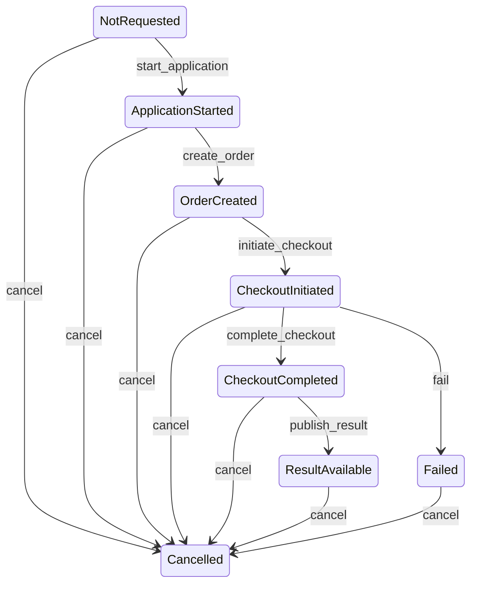
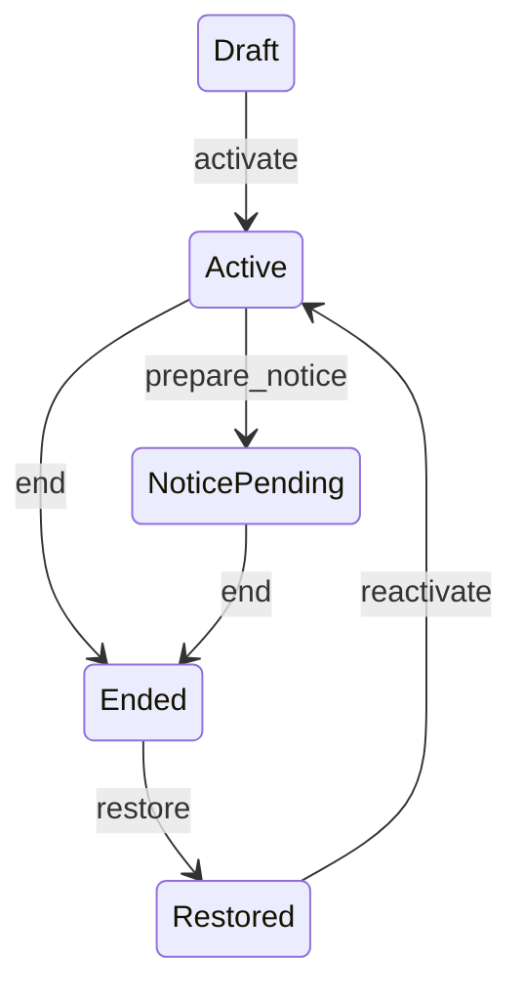
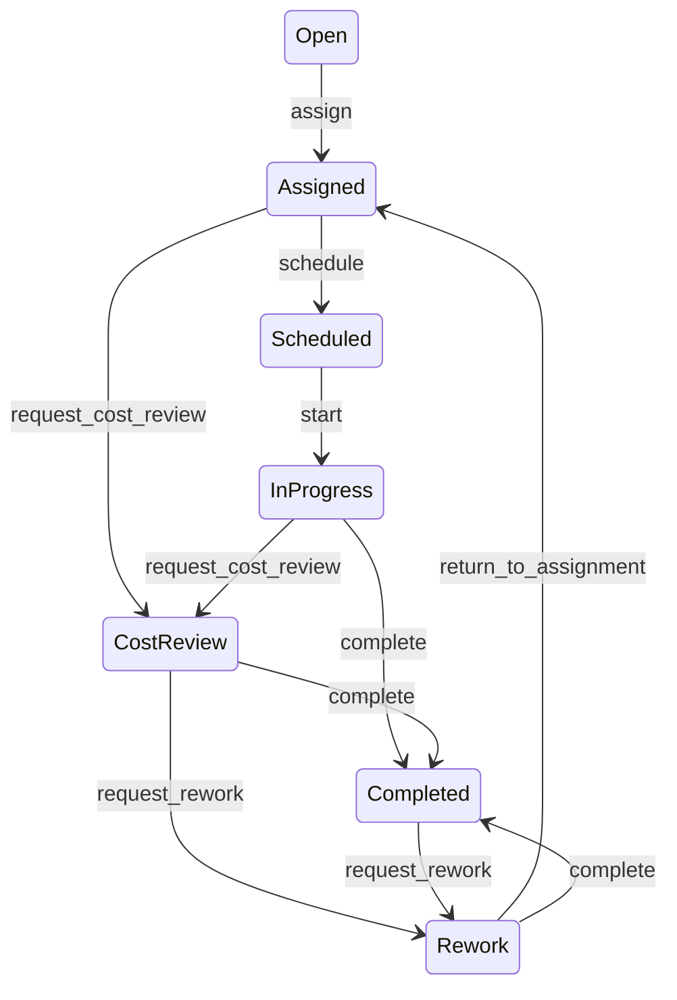
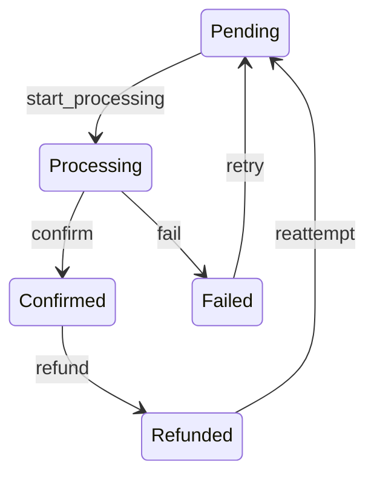
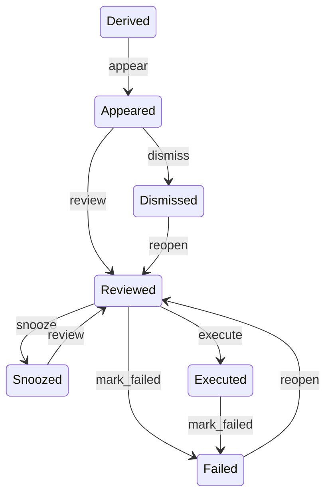

# State Machines V1

## Purpose

State Machines V1 defines deterministic review-state semantics for screening, lease, maintenance, payment, and decision workflows. The implementation is infrastructure-only for Phase 2 Mission 2: it computes state from existing records, validates proposed transitions, and adds advisory route markers without changing current route behavior.

## Shared Rules

- State computation is pure and uses existing persisted records.
- Validators return `{ valid, allowedTransitions, reason }` through a consistent public API.
- Validators fail closed when authority, current state, or required context is missing.
- No state machine definition is stored in Firestore.
- No transition enforcement is enabled in this mission.
- Browser-only form state remains distinct from persisted workflow state.
- State machine metadata is not added to tenant-facing exports, documents, or dashboards.

## Screening

| State | Meaning | Required context for forward transitions |
| --- | --- | --- |
| `NotRequested` | No application/order/payment/result state exists. | `applicationId`, `landlordId` |
| `ApplicationStarted` | Application state exists before an order. | `applicationId`, `orderId` |
| `OrderCreated` | Screening order exists before checkout. | `orderId`, `checkoutSessionId` |
| `CheckoutInitiated` | Checkout was created and is awaiting completion/failure. | `orderId`, payment result context |
| `CheckoutCompleted` | Payment is complete; result is not yet available. | `applicationId`, `resultId` |
| `ResultAvailable` | Screening result is available. | terminal for normal flow |
| `Failed` | Screening or payment failed. | terminal unless cancelled for administrative closure |
| `Cancelled` | Workflow was cancelled. | terminal |

Authority: landlord or admin context with explicit authorization.

Idempotency: repeated terminal transitions should be treated by caller services as no-op or invalid according to existing route behavior; the V1 validator only reports allowed next states.

Event continuity: screening events and transaction records remain the append-safe history source.

## Lease

| State | Meaning | Required context |
| --- | --- | --- |
| `Draft` | Draft or generated lease record before activation. | `leaseId`, `landlordId` |
| `Active` | Current active lease. | `leaseId`, `landlordId`; optional notice context |
| `NoticePending` | Lease notice or renewal workflow is pending. | `leaseId`, `landlordId`, `noticeId` |
| `Ended` | Lease was ended, expired, or terminated. | explicit restore context for reversal |
| `Restored` | Ended lease has been restored and can reactivate. | `leaseId`, `landlordId` |

Authority: landlord or admin context with explicit authorization.

Idempotency: direct `Ended -> Active` is invalid; restoration must pass through `Restored`.

Event continuity: lease status is mutable current state. Lease notices and selected lifecycle actions preserve append-safe workflow events.

## Maintenance

| State | Meaning | Required context |
| --- | --- | --- |
| `Open` | Submitted request not yet assigned. | `workOrderId`, `assignedContractorId` |
| `Assigned` | Contractor or operational owner is assigned. | schedule or cost context |
| `Scheduled` | Work is scheduled. | `workOrderId` |
| `InProgress` | Work has started. | cost or evidence context depending on transition |
| `CostReview` | Cost review is pending or revision/rejection is active. | `workOrderId`; cost approval context |
| `Completed` | Work is complete. | rework context if reopening |
| `Rework` | Rework cycle is active. | assignment or completion context |

Authority: landlord/admin for assignment and review; contractor/landlord/admin for schedule, start, cost submission, and completion; tenant/landlord/admin for rework request.

Idempotency: repeated completion should be handled by caller services using existing work order history. V1 reports valid next states only.

Event continuity: status history, cost review history, rework history, and work order updates remain the append-safe evidence source.

## Payment

| State | Meaning | Required context |
| --- | --- | --- |
| `Pending` | Payment exists or is ready for processing. | `paymentId`, `paymentIntentId` |
| `Processing` | Checkout or payment is awaiting confirmation/failure. | persisted transaction status |
| `Confirmed` | Payment is recorded as paid, confirmed, completed, or recorded. | refund context for reversal |
| `Failed` | Payment failed, expired, or was cancelled. | retry context |
| `Refunded` | Payment has been refunded. | reattempt context |

Authority: authenticated tenant, landlord, admin, or system context depending on caller surface.

Idempotency: final-state protection remains in existing payment services. V1 does not call external payment APIs.

Event continuity: payment events and payment intent events remain the append-safe evidence source.

## Decision

| State | Meaning | Required context |
| --- | --- | --- |
| `Derived` | Decision exists only as a derived read model. | `decisionId`, `landlordId`, valid source |
| `Appeared` | Decision appearance has been recorded or action state has started. | review or dismissal context |
| `Reviewed` | Operator reviewed the decision. | action record for downstream action |
| `Snoozed` | Decision is deferred until a future time. | `snoozedUntil` |
| `Dismissed` | Decision was dismissed and can be reopened. | action record |
| `Executed` | Decision action was executed. | failure context if operation fails |
| `Failed` | Execution failed and can be reopened for review. | valid source |

Authority: landlord or admin context with explicit authorization and ownership.

Idempotency: decision appearance is append-safe through canonical events. Action state remains a current-state record until a future mission extends event emission.

## Error Cases

| Error | Meaning | Expected caller behavior |
| --- | --- | --- |
| `invalid_transition` | Proposed state is not allowed from current state. | Return or log clear validation reason; do not mutate state. |
| `insufficient_authority` | Actor context is missing or role is not allowed. | Fail closed in enforcing callers. Advisory markers log only. |
| `missing_context` | Required identifiers or transition fields are absent. | Request more context before attempting mutation. |
| `ambiguous_state` | Persisted state is not enough to safely validate the transition. | Keep existing behavior in Phase 2; enforce later only with explicit migration plan. |
| `terminal_state` | Terminal workflow state cannot proceed. | Treat as no-op or error according to existing route contract. |
| `source_invalid` | Source decision or workflow context is stale or invalid. | Refresh source model before attempting action. |

## Integration Points

Implemented in this mission:

- `rentchain-api/src/services/stateMachines/types.ts`
- `rentchain-api/src/services/stateMachines/*StateMachine.ts`
- `rentchain-api/src/services/stateMachines/stateComputation.ts`
- `rentchain-api/src/services/stateMachines/transitionValidation.ts`
- `rentchain-api/src/services/stateMachines/stateMachineRegistry.ts`
- Advisory markers in screening operations, lease detail, maintenance list, payment list, and decision list routes.

Not implemented in this mission:

- Enforcing state transitions in existing mutation routes.
- Persisting state machine snapshots.
- Persisting browser form drafts.
- Adding cross-workflow synchronization.
- Adding external exports of state machine metadata.

## Future Work

- Phase 2 Mission 3 should attach evidence provenance to transition events and advisory snapshots.
- Phase 2 Mission 4 should reconcile derived decisions with stored action state and canonical timeline entries.
- A later enforcement mission can convert advisory route markers into blocking transition checks once migration risks are reviewed.
