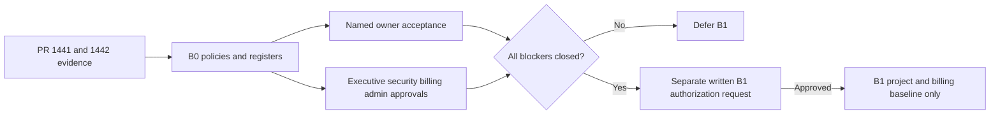

# Phase B B0 Administrative Prerequisites

> Status: evidence package only. B1 and all Phase B implementation remain **unauthorized**.

## Purpose

B0 converts the architecture approved for governance review in PR #1442 into an administrative gate. PR #1441 proved a bounded keyless Vercel Preview-to-IAM-protected Cloud Run identity bridge; it did not prove permanent ownership, billing, Terraform, data, or operating controls. PR #1442 selected a shared permanent isolated non-production foundation, ephemeral exact-head compute, and shared namespaced synthetic data with serialized mutation workflows.

## Evidence versus recommendation

- **Confirmed:** the merged PR #1441 technical proof and teardown; the merged PR #1442 architecture, prohibitions, cost estimates, and B0–B10 sequence; repository configuration findings cited there.
- **Recommended:** create a new purpose-built Preview project; use the ownership, cost, Terraform, trust, IAM, privacy, and provider policies in this package.
- **Unresolved and blocking:** named owners, organization placement, billing authority, Terraform Cloud administration/state, Vercel administrative confirmation, project creation authority, and written B1 authorization.

## Gate outcome

B0 is not complete merely because these templates exist. Every blocking checklist item requires independently reviewable, non-sensitive evidence and owner acceptance. Blank, self-approved, stale, or contradictory evidence means defer.

## B1 boundary

A later, separately authorized B1 may confirm or create the approved isolated project, attach only the approved billing account, apply labels, establish ownership records, create budget alerts, verify placement, capture evidence, and stop. Baseline API enablement is recommended for B2 so B1 remains administrative and reversible. B1 excludes Terraform Cloud setup, Cloud Run, WIF, service accounts, Vercel changes, Firebase, Firestore, Storage, fixtures, providers, and QA.

## Package map

See the [project decision](phase-b-b0-project-placement-decision.md), [ownership model](phase-b-b0-ownership-and-raci.md), [billing authorization](phase-b-b0-billing-and-cost-authorization.md), [Terraform authority](phase-b-b0-terraform-authority.md), [Vercel trust policy](phase-b-b0-vercel-trust-policy.md), [IAM policy](phase-b-b0-iam-policy.md), [privacy policy](phase-b-b0-synthetic-data-and-privacy-policy.md), [provider authority](phase-b-b0-provider-suppression-authority.md), [evidence register](phase-b-b0-evidence-register.md), [decision register](phase-b-b0-decision-register.md), [B1 checklist](phase-b-b0-b1-authorization-checklist.md), and [executive brief](phase-b-b0-executive-approval-brief.md).
