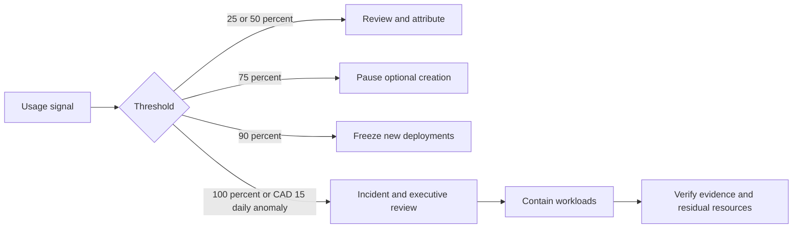

# Phase B B0 Billing and Cost Authorization

## Proposed decision

These are planning estimates, not commitments: CAD 0–20/month idle, CAD 10–60 normal active, approximately CAD 0.25–2.00 per active PR, CAD 100 proposed monthly ceiling, and CAD 15/day abnormal-use threshold. Provider prices, exchange rates, taxes, free tiers, Vercel limits, and Terraform Cloud charges must be revalidated immediately before B1.

Tax treatment is **unresolved**; estimates exclude tax unless the billing owner documents otherwise.

## Alerts and authority

| Threshold | Proposed response | Required recipient/authority |
| --- | --- | --- |
| 25% / CAD 25 | informational trend review | billing and engineering owners |
| 50% / CAD 50 | validate drivers and retained resources | billing, engineering, cloud |
| 75% / CAD 75 | pause optional Preview creation | billing owner |
| 90% / CAD 90 | freeze new deployments; executive review | billing and executive owners |
| 100% / CAD 100 | operational stop; contain expired workloads | executive plus billing/cloud owners |
| CAD 15/day | same-day anomaly investigation | billing, incident, engineering |

Budget alerts are detective notifications and do not automatically stop spending. Workload stop, billing disablement, and resource deletion are separate controlled actions. Billing disablement requires executive/billing approval because it can disrupt evidence and APIs; deletion requires the resource owner and incident/evidence check.

## Governance

Required recipients: named billing, engineering, cloud, executive, and incident owners plus backups. Review weekly during rollout and monthly thereafter. Every resource must carry environment, owner, cost-center, lifecycle, and phase labels. Unexpected cost triage records service/SKU, date, authorized workload, retained resources, suspected abuse, containment, forecast, and closure without exposing billing identifiers.

Status: **requires billing and executive approval; blocking**.
