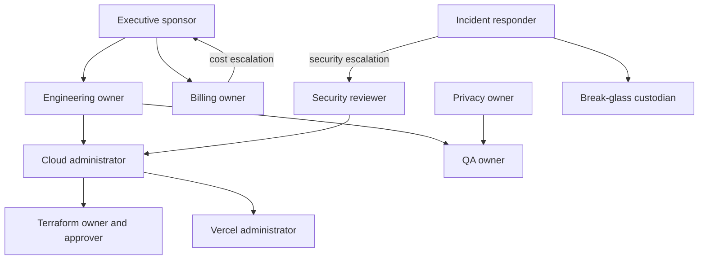

# Phase B B0 Ownership and RACI

No individual is assigned by repository evidence. Every role below is **unresolved and blocking** until a named individual and backup provide written acceptance.

| Role | Responsibilities / authority | Prohibited self-approval | Escalation / backup | Acceptance evidence | Status |
| --- | --- | --- | --- | --- | --- |
| Executive sponsor | residual risk, funding, B1 go/no-go | cannot substitute for technical evidence | executive backup | signed scope/cost/risk decision | Unresolved/blocking |
| Engineering owner | architecture, sequence, delivery accountability | own privileged change approval | executive; senior engineering backup | written ownership | Unresolved/blocking |
| Cloud administrator | hierarchy, project, IAM execution | security approval of own IAM | security; cloud backup | admin authority confirmation | Unresolved/blocking |
| Security reviewer | WIF/IAM/trust/threat approval | implement and solely approve | executive; security backup | signed review | Unresolved/blocking |
| Billing owner | account attachment, alerts, freeze | approve unexplained overage alone | executive; finance backup | billing authority attestation | Unresolved/blocking |
| QA owner | fixture/test evidence, serialization | privacy exception approval | engineering; QA backup | QA acceptance | Unresolved/blocking |
| Terraform owner | workspace/state/variables | sole plan/apply approval | engineering; TF backup | organization/workspace evidence | Unresolved/blocking |
| Terraform approver | plan/apply/destroy decision | approve own authored privileged plan alone | executive/security backup | approver acceptance | Unresolved/blocking |
| Vercel administrator | project/OIDC/Preview controls | solely authorize own trust widening | security; Vercel backup | admin console attestation | Unresolved/blocking |
| Incident responder | containment, evidence, recovery | delete evidence without approval | security/executive; on-call backup | incident acceptance | Unresolved/blocking |
| Privacy/data owner | synthetic schema, retention, exceptions | approve own data exception | security; privacy backup | policy acceptance | Unresolved/blocking |
| Provider-suppression approver | exception decisions | request and approve same exception | security/product backup | exception authority acceptance | Unresolved/blocking |
| Break-glass custodian | time-bound emergency access | routine use or self-approval | executive/security dual control | sealed procedure acknowledgement | Unresolved/blocking |

Where staffing makes separation impractical, record the exception, compensating second review, expiry, and audit trail. “Named individual required” is not an assignment.
