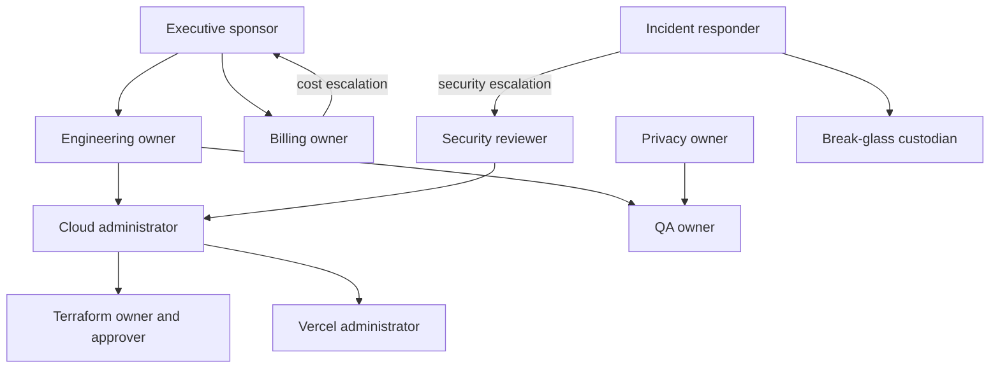

# Phase B B0 Ownership and RACI

The Founder has supplied written acceptance for every current accountable role. This consolidates authority at the solo-founder stage and does not constitute independent review. No backup is currently assigned.

| Role | Current owner / status | Independence and compensating controls | Escalation / backup | Future separated owner / trigger |
| --- | --- | --- | --- | --- |
| Executive sponsor and B1 authorization owner | Founder — Paul; assigned and accepted | founder-approved; written scope/risk/cost decision | qualified advisor; no backup assigned | executive leader; first suitable hire or material risk expansion |
| Engineering owner | Founder — Paul; assigned and accepted | exact-head, CI, bounded reversible stages | engineering specialist; no backup | engineering lead; first engineering hire |
| Cloud administrator | Founder — Paul; assigned and accepted | least privilege, inventory, rollback evidence | cloud vendor/support; no backup | platform/cloud lead; infrastructure expansion |
| Security reviewer | Founder — Paul; assigned and accepted | not independently reviewed; external review on triggers | security consultant; no backup | security owner; enterprise/regulatory requirement |
| Billing owner | Founder — Paul; assigned and accepted | budgets, thresholds, documented stop decisions | accountant/FinOps specialist; no backup | finance/FinOps owner; material spend |
| QA owner | Founder — Paul; assigned and accepted | deterministic evidence and explicit acceptance | QA specialist; no backup | QA lead; first suitable hire |
| Terraform owner and approver | Founder — Paul; assigned and accepted | saved plans, exact-head, CI, bounded scope, drift/post-action evidence | Terraform/cloud specialist; no backup | separate author/approver; first qualified support |
| Vercel administrator | Founder — Paul; assigned and accepted | manual exact-head trust and revocation evidence | Vercel support/platform specialist; no backup | platform/release owner; team growth |
| Incident responder | Founder — Paul; assigned and accepted | written event trail and post-event review | security/vendor support; no backup | incident lead/on-call rotation; first qualified support |
| Privacy/data-governance owner | Founder — Paul; assigned and accepted | synthetic-only policy; legal/privacy review on trigger | legal counsel/privacy specialist; no backup | privacy officer; real-data or enterprise requirement |
| Provider-suppression approver | Founder — Paul; assigned and accepted | separate written exception; no exception in B0 | legal/security/product specialist; no backup | provider-risk owner; first real provider connection |
| Break-glass custodian | Founder — Paul; assigned and accepted | non-routine, keyless, time-bound, logged, removed, reviewed | qualified secondary custodian when available; no backup | two-custodian model; first qualified support |

## Mandatory independent-review triggers

Obtain a qualified second person or external specialist before production IAM or data changes, public protected-service access, static credentials, material privacy exceptions, live payments/screening/PAD/banking, material legal or regulatory obligations, destructive production Terraform, budget increases above CAD 100/month, broad IAM/wildcard federation, unresolved security findings, enterprise separation requirements, or any action the Founder determines exceeds bounded non-production risk.

## Governance maturity

1. **Solo founder:** consolidated roles; documented compensating controls; no independent-review claim.
2. **First qualified support:** separate infrastructure/IAM implementation from approval, add incident/break-glass backup, separate QA evidence.
3. **Enterprise-readiness team:** separate engineering, security, cloud, billing, privacy, and provider approvals; two-person production/destructive review.
4. **Regulated/institutional scale:** independent oversight, formal change management, access reviews, vendor risk, continuity and disaster-recovery ownership.
