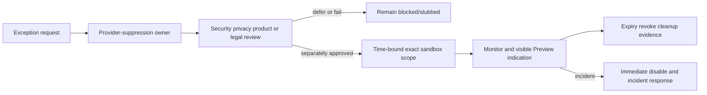

# Phase B B0 Provider Suppression Authority

Provider access is deny-by-default. A real non-production provider account always requires separate written authorization; B0 does not grant it.

| Category | Default | Exception authority / maximum scope | Evidence, expiry, logging, rollback |
| --- | --- | --- | --- |
| Certn/screening | stubbed state | security, product, privacy; synthetic sandbox case only | test plan, cost/data review, ≤7 days; reason/status only; revoke credentials/disable adapter |
| Stripe | blocked or deterministic stub | security/finance/product; provider test mode only | no real payment method; ≤7 days; safe event metadata; revoke endpoint/keys |
| PAD/Rotessa | blocked | separate executive/legal/security mission; none in Phase B | no exception under B0 |
| Email | local capture sink | security/privacy/product; test aliases/non-delivery only | recipient class/count; expiry; disable sink |
| SMS/push | blocked | security/privacy/product; provider sandbox only | synthetic recipient; cost cap; revoke |
| Signing | stubbed | legal/security/product sandbox approval | synthetic document; expiry; revoke |
| Webhooks | local record-only sink | security; exact synthetic endpoint | URL allowlist/hash/status; remove endpoint |
| Analytics/error reporting | blocked or isolated redacted sink | privacy/security | schema/redaction/retention; disable project |
| AI/LLM | blocked/deterministic fixture | security/privacy/product | prompt-data review; no customer data; revoke |
| Calendar/contractor dispatch | blocked/internal state | security/product | synthetic target only; disable integration |
| Production Storage | blocked | no exception | denied access event; investigate |
| Third-party exports | blocked/local fixture | privacy/security/legal | synthetic export only; delete/revoke |

All Preview UI shows a persistent synthetic-environment/external-actions-disabled indication. Logs contain provider category, mode, decision, run ID, safe reason, and commit—not credentials, recipients, payloads, or financial values.

Status: **policy recommended; named exception authority and approvals unresolved/blocking**.
