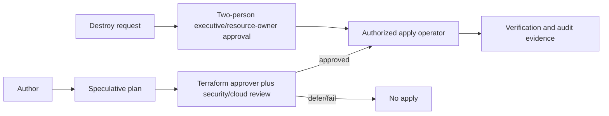

# Phase B B0 Terraform Authority

Founder-approved policy requires isolated Preview/production state and a dedicated workspace or equivalent boundary. Repository evidence still does not prove actual Terraform Cloud organization ownership, workspace configuration, state, variables, or recovery controls. No Terraform change is authorized.

## Proposed authority model

| Control | Recommendation |
| --- | --- |
| Organization owner | Named administrator required; not inferred from repository. |
| Workspace | `rentchain-preview-foundation` or approved convention, isolated from production. |
| State | Remote locked non-production state; no production remote-state dependency. |
| Variables | Non-sensitive configuration VCS-managed; sensitive values owned by restricted variable-set custodians. |
| Plan | Trusted VCS events and authorized humans; read access for reviewers. |
| Apply | Named operators after recorded approval; never untrusted PR auto-apply. |
| Destroy | Dual approval, protected-resource/evidence check, explicit target list. |
| Lock/unlock | Terraform owner; force unlock requires second approver and incident record. |
| Import | Terraform owner plus cloud administrator after inventory/no-op plan. |
| Recovery | State version/recovery procedure rehearsed and owner assigned. |
| Drift | Scheduled read-only review; alert only, no automatic remediation. |
| Audit logs | Retain per enterprise policy; minimum recommendation 365 days, subject to legal/security approval. |
| Break glass | Time-bound, dual-approved, monitored, retrospective required. |

Prohibited: shared Preview/production state, unmanaged local production state, committed secrets, broad workspace access, untrusted automatic applies, or undocumented plan/apply/destroy events. Founder — Paul currently holds owner and approver roles; this is not independent separation. Compensating controls are saved plans, exact-head verification, passing CI, bounded written scope/approval, drift review, and post-action evidence. Independent review is mandatory when a trigger in the ownership policy applies.

## Evidence before B1/B2

Before B1: organization/account owner attestation, proposed workspace/state owner, production-separation diagram, and import/no-reuse decision. Before B2: actual workspace ID (kept out of public docs if sensitive), permissions export, variable ownership, lock/recovery proof, plan/apply/destroy workflow, audit retention, and approved no-op baseline plan.

Status: **policy founder-approved; not independently reviewed**. Workspace/state creation, permissions, locks, imports, and recovery remain unimplemented facts. B0 creates no workspace; B1 includes none unless separately enumerated.
