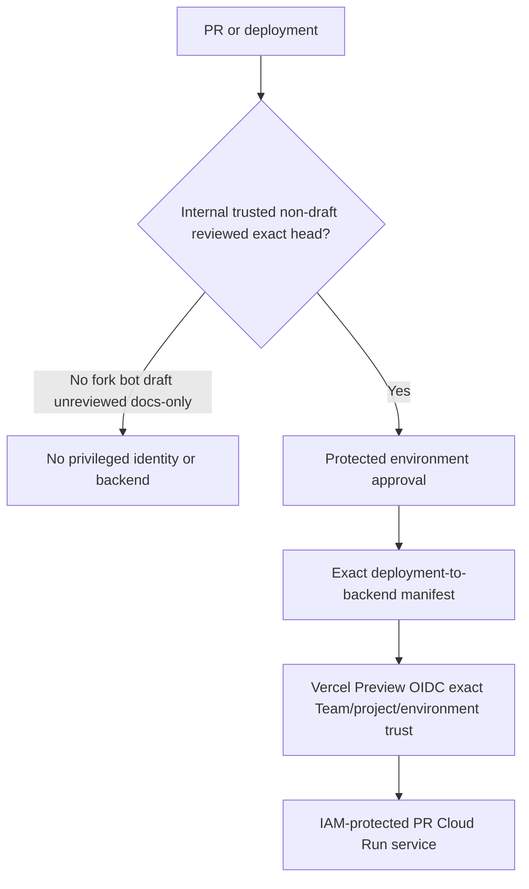

# Phase B B0 Vercel Trust and Privileged Preview Policy

## Founder-approved eligibility

| Deployment source | Privileged backend/fixtures | Rule |
| --- | --- | --- |
| Same-repository internal PR | Conditional | non-draft, trusted author, reviewed, exact head, approved label/environment gate |
| Trusted branch | Conditional | branch allowlist and protected workflow only |
| Fork/contributor PR | No | frontend-only or no Preview; never federated identity |
| Dependabot/automated/bot PR | No by default | dependency checks only; explicit human promotion creates a new trusted run |
| Draft/unreviewed PR | No | no privileged environment |
| Documentation-only PR | No privileged need | ordinary Vercel Preview may remain, identity bridge disabled |
| Production branch | No Preview identity | separate production controls |
| Manual deployment | No by default | time-bound dual-approved exception with exact SHA |

## Trust contract

Team owner `rent-chain`, project `rentchain`, Team issuer `https://oidc.vercel.com/rent-chain`, environment `preview`, expected audience, and exact subject/attribute conditions require revalidation from current Vercel token documentation/evidence before implementation. PR #1441 proved the bounded pattern; its subject did not distinguish every PR, so eligibility must also be enforced by trusted deployment orchestration, protected environment approval, and exact backend mapping.

Founder — Paul currently owns trusted-PR designation, Preview variables, OIDC, deployment protection, promotion, and trust revocation. This manual control is internally accepted under solo-founder governance and is not independently approved. External review is required when a mandatory trigger applies.

Server-only variables are Preview-scoped and never exposed to browser bundles. The proxy accepts no client-selected origin. Preview domains map through a trusted deployment ID/SHA manifest. Revocation disables mapping, removes service-level invocation binding, invalidates the deployment, and records evidence.

Status: **founder-approved policy; not independently reviewed**. Actual Vercel trust/configuration and current claim validation remain unimplemented technical facts.
