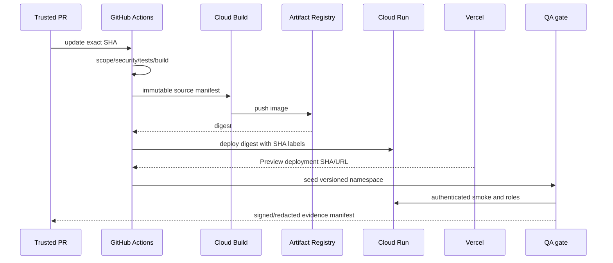
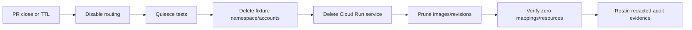

# Phase B CI/CD and Exact-Head Proof

## Deployment flow

## Routing

The Vercel same-origin server proxy receives no client-selected backend URL. Trusted deployment metadata maps Vercel deployment ID and Git SHA to one allowlisted Cloud Run URL. The proxy obtains an ID token for that exact service audience. Missing, stale, ambiguous, non-HTTPS, production, or SHA-mismatched mappings return 503. No production fallback exists.

## Proof manifest

Before QA, record and compare:

- GitHub repository, PR, exact 40-character head SHA, workflow run, and trusted-ref decision.
- Vercel project/environment/deployment ID and source SHA.
- Cloud Build ID/source SHA, Artifact Registry URI and immutable digest.
- Cloud Run project, region, service, revision, runtime identity, image digest, and reported commit SHA.
- fixture schema version, seed version/hash, namespace/run ID, expiry, and cleanup owner.

The backend exposes a non-sensitive authenticated build-info response. The proxy rejects mismatch; QA also verifies it independently. Evidence posted to the PR excludes tokens, internal IDs, project numbers, credentials, and raw fixture data.

## Permission allocation

CI reads source and produces attestations; deployment uses keyless narrow credentials; runtime reads only Preview application data; tests receive only role credentials and namespace rights; humans approve Terraform applies, destructive cleanup exceptions, and release of held evidence.

## Rollback and cleanup

Rollback selects a prior approved digest for the same Preview project only and generates new evidence. A PR close/expiry event disables routing, deletes its service after evidence capture, removes fixture namespace/accounts, prunes images/revisions, and verifies absence.

