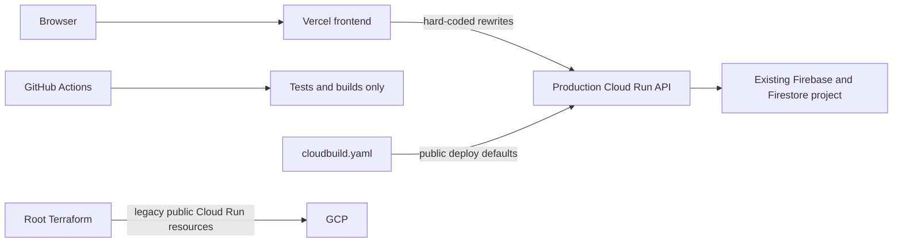

# Phase B Current-State Audit

> Facts observed in the repository; no infrastructure was queried or changed.

## Topology

| Area | Repository fact | Preview blocker |
| --- | --- | --- |
| Frontend routing | `rentchain-frontend/vercel.json` rewrites `/api` and `/health` to the production Cloud Run URL; CSP also permits broad `*.a.run.app`. | Preview can reach production. |
| Proxy | `rentchain-frontend/api/[...path].ts` is the correct server-only seam but currently has no permanent OIDC bridge. | Authenticated Preview routing is not implemented. |
| Backend project | `rentchain-api/src/firebase/admin.ts` pins a project identifier. | A Preview revision could select the wrong data project. |
| Environment guard | Production mode permits non-emulator Firestore; non-production normally requires an emulator. | There is no explicit cloud Preview classification. |
| Required providers | Production startup requires Stripe, internal token, Firebase, and email configuration. | Preview cannot safely start without real-looking provider secrets or a new suppressed mode. |
| Cloud Build | `rentchain-api/cloudbuild.yaml` defaults to production naming, prints environment context, deploys with `--allow-unauthenticated`. | Must not be reused for Phase B. |
| Terraform | Root configuration has no visible remote-state declaration, uses legacy Cloud Run resources, and grants `allUsers` Invoker. | State ownership and safe Preview modules are unresolved. |
| GitHub Actions | CI has read-only contents permission and tests/builds; no Preview deploy, seed, smoke, or cleanup workflow. | New narrowly scoped workflow is required later. |
| Firebase | `firebase.json` configures Firestore rules/indexes and Firestore emulator, not an Auth emulator. | Auth/data isolation needs explicit design. |
| Storage | Backend reads/writes signed documents and screening exports through Admin Storage APIs. | Production buckets must be impossible to select. |
| QA | Playwright supports role storage-state files and existing fixture runbooks. | Existing capture/runbooks are not a remote Preview fixture authority. |

## Production assumptions and coupling

The repository treats the current Vercel/API/Firestore path as production. Preview and production are not presently separated end to end. The highest-risk couplings are hard-coded API rewrites, hard-coded Firebase project selection, provider-required production startup, public Cloud Run defaults in deployment files, and scripts that can write non-emulator Firestore with explicit overrides.

## What already exists

- Vercel Preview deployment and a server-function proxy seam.
- CI builds/tests, Cloud Build configuration, Terraform files, Firestore rules/indexes, Playwright role suites, fixture examples, and environment governance docs.
- PR #1441 evidence for a narrow keyless Vercel-to-Cloud-Run identity bridge.

## What must be created later

An isolated project decision; governed Terraform state; budget and labels; permanent keyless identities; exact-head deployment workflow; environment assertions; non-production Auth/Firestore/Storage; synthetic fixture lifecycle; provider suppression; authenticated smoke evidence; cleanup automation; and operational ownership.

## Ambiguities requiring evidence

Terraform Cloud workspace/state ownership, organization/folder authority, billing owner, Vercel administrator, whether the emptied spike project may be repurposed, and the exact current production resource inventory cannot be proven from repository files. These ambiguities block implementation authorization but not this planning package.
