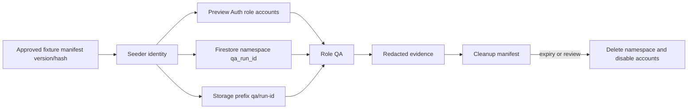

# Phase B Data, Auth, and Fixture Model

## Timing decision

Stages B1–B5 can prove project, deployment, exact-head, and identity boundaries with a trivial authenticated health surface. Firebase is deferred to B6, after backend project selection, environment assertions, and provider suppression are implemented and reviewed. Authenticated product QA requires dedicated Preview Firebase Auth and Firestore; it must not reuse production.

## Data classification

| Domain | Preview rule |
| --- | --- |
| Auth accounts | Synthetic role accounts only; no customer emails/phones. |
| Firestore | Deterministic synthetic properties, units, leases, messages, maintenance, screening/payment status facsimiles, and audit events. |
| Storage | Synthetic documents only in a dedicated bucket; no production signed-document copy. |
| Screening/payments | State fixtures only; never provider evidence or money state. |
| Logs/evidence | Non-sensitive labels, hashes, counts, reason codes; no tokens/raw IDs/payloads. |

## Fixture flow

## Fixture contract

Every record carries `qaFixture=true`, schema/seed version, run ID, owner, created/expiry timestamps, and deterministic business-safe reference. IDs are generated from manifest inputs and may never collide with production conventions. A signed or hashed run manifest lists expected counts and cleanup targets without printing raw internal IDs.

Role fixtures: landlord, tenant, property manager, and only when necessary administrator. Login uses dedicated Preview Auth and short-lived test credentials held outside the repository. Storage-state artifacts are encrypted/ephemeral, never uploaded by default, and expire after the run.

## Reset, concurrency, retention

Non-mutating smoke runs may share a baseline namespace. Mutation suites obtain a lease on one run namespace and execute serially. Reset is manifest-driven delete/reseed, not collection-wide deletion. Normal fixtures expire within seven days; defect reproduction may receive an approved maximum 30-day hold. Auth accounts are disabled/deleted with the run. Cleanup must be idempotent and fail closed outside approved prefixes.

## Access and privacy

Application authorization remains authoritative; fixture IDs do not grant access. Log admin reads, seed/reset actions, and denied cross-role probes. Never copy production snapshots, emails, phone numbers, documents, tokens, payment instruments, screening payloads, or provider identifiers.

## PR #1435 readiness

B10 can seed a landlord/tenant lease and message thread, authenticate both roles, test route continuity and projections, and capture exact-head evidence. This package does not modify or validate PR #1435.
