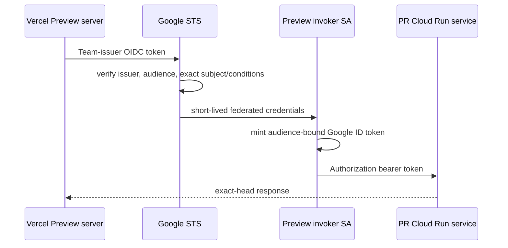

# Phase B IAM and Identity Model

## Permanent identity flow

PR #1441 validated this pattern with issuer `https://oidc.vercel.com/rent-chain`, expected Vercel audience, and Preview project/environment subject. The permanent design must preserve the distinction among provider issuer/audience, STS canonical audience, and Cloud Run service audience.

## IAM matrix

| Principal | Resource | Least role/capability | Scope | Prohibited expansion |
| --- | --- | --- | --- | --- |
| GitHub deploy WIF principal | Preview image repository | Artifact Registry writer | One repository | Project Editor/Owner |
| GitHub deploy WIF principal | Preview Cloud Run | Deploy/update capability validated before grant | Preview project/services | Production or public IAM |
| GitHub deploy principal | Runtime SA | Service Account User | That SA only | Token Creator by default |
| Cloud Build execution SA | Source bucket and image repository | Object reader on source prefix; repository writer | Exact resources | Project Storage/AR admin |
| Vercel Preview WIF principal | Invoker SA | Workload Identity User | Exact subject/attribute set | Wildcard principal set |
| Invoker SA | PR Cloud Run services | Cloud Run Invoker | Service level | Project-level Invoker |
| Runtime SA | Preview Firestore/Storage | Minimum data access validated per API | Preview resources | Production or admin roles |
| Seeder SA | Fixture namespace | Narrow create/update/delete | Preview data only | Runtime/deploy access |
| Cleanup SA | Expired Preview resources | Narrow lifecycle delete | Label/manifest constrained | Broad project deletion |
| Human cloud admin | Preview project | Time-bound administrative role | Preview only | Routine Owner use |
| Break-glass group | Preview project | Emergency pre-approved role | Time-bound, audited | Automation use |

## Trust conditions

Use separate GitHub and Vercel pools/providers. Bind GitHub to the exact organization, repository, trusted workflow file/ref, and approved environment. Bind Vercel Team issuer to owner `rent-chain`, project `rentchain`, environment `preview`, expected audience, and exact subject; add deployment/branch claims only after Vercel documentation and token evidence validate them. The current subject does not distinguish every PR, so malicious-Preview risk remains and is contained with synthetic data, trusted-PR deployment gating, application auth, and per-service routing.

## Separation of duties

Terraform approvers create durable IAM. Deployment automation cannot modify federation or budgets. Vercel administrators cannot deploy backend IAM. QA can seed/reset only approved namespaces. Billing and security reviewers can freeze the environment. Break-glass use requires incident ticket, expiry, and retrospective.

## Absolute prohibitions

No JSON service-account keys, wildcard federation, browser credentials, production identity reuse, project-wide Invoker, automation Owner/Editor, or Token Creator unless a separately documented API flow proves it is essential.
