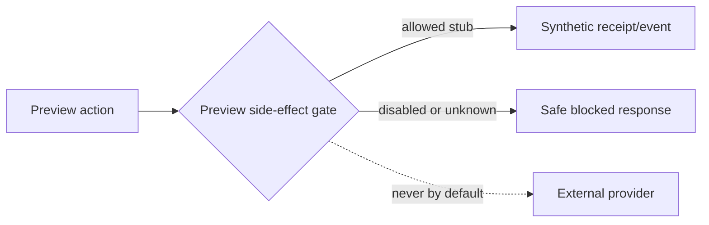

# Phase B Provider Suppression Policy

## Rule

Preview is deny-by-default. Startup fails unless `environment=preview`, the isolated project manifest matches, and every provider is explicitly in `stub`, `record-only`, or `disabled` mode. Unknown configuration fails closed. A visible banner states “Synthetic Preview — external actions disabled.”

| Provider/domain | Default | Allowlist | Evidence/logging | Failure/UI behavior |
| --- | --- | --- | --- | --- |
| Certn/screening | Stub state only | Separate synthetic sandbox mission | reason code, no payload | “Screening simulation only” |
| Stripe | Disabled/read-model fixture | Provider sandbox only after approval | no keys/webhook bodies | no charge/subscription mutation |
| PAD/Rotessa | Disabled | None in Phase B | blocked event only | no authorization/schedule/money movement |
| Email | Capture sink or stub | Approved non-delivering test domain | recipient class/count | “Email not sent” |
| SMS/push | Disabled | Provider sandbox after security review | channel/reason | “Notification not sent” |
| Webhooks | Local record-only sink | Exact allowlisted synthetic endpoint | hash/status | no outbound unknown URL |
| Document signing | Stub lifecycle | Provider sandbox separate | synthetic status | no signature request |
| Analytics | Disabled or isolated nonprod property | Explicit product/privacy approval | event name only | no production dataset |
| Error reporting | Local/redacted logs | Isolated nonprod project | no PII/tokens | fail app-safe, not leak-safe |
| AI/LLM | Disabled/deterministic fixture | Separate data/security approval | prompt class/hash only | no outbound prompt |
| Calendar | Disabled | None by default | blocked reason | no external event |
| Contractor dispatch | Internal synthetic state only | None by default | audit event | no message/assignment outside Preview |
| Production Storage | Denied | Never | denied resource class | fail unavailable |

## Enforcement layers

Use typed provider modes, startup validation, outbound destination allowlists, test assertions, UI labels, and network/identity least privilege. Do not rely on missing secrets alone. CI scans manifests and tests each provider gate. Runtime logs safe provider name, mode, action class, decision, run ID, and commit—not recipients, credentials, payloads, or financial amounts.

Any exceptional live sandbox test needs its own authorization, time-box, provider-specific identity, synthetic recipient, cost cap, teardown, and evidence. It may not weaken the default Preview policy.
