# Phase B Rollout and Acceptance Plan

```mermaid
flowchart LR
  B0[B0 approvals] --> B1[B1 project/budget]
  B1 --> B2[B2 Terraform state/APIs]
  B2 --> B3[B3 deploy identity]
  B3 --> B4[B4 Cloud Run foundation]
  B4 --> B5[B5 Vercel bridge]
  B5 --> B6[B6 Auth/data]
  B6 --> B7[B7 fixtures]
  B7 --> B8[B8 provider suppression]
  B8 --> B9[B9 role QA]
  B9 --> B10[B10 PR 1435 readiness]
```

Each stage requires a separate authorization and PR. Stop on scope drift, production reference, static credential, public access, failed security check, unknown cost, or unowned rollback.

| Stage | Scope/dependencies | Acceptance/evidence | Rollback/resources/cost | Authorization |
| --- | --- | --- | --- | --- |
| B0 | Assign owners, hierarchy, project reuse decision, TFC workspace, budget. | Signed checklist; all unknowns owned. | Docs only; none/CAD 0. | Executive, cloud, security, billing, Terraform, Vercel. |
| B1 | Dedicated project and billing controls after B0. | labels, budget alerts, no production IAM/data. | detach/freeze/delete if empty; project/budget/CAD 0–5. | Explicit infrastructure approval. |
| B2 | Separate Terraform state, baseline APIs/policies. | remote lock, plan approval, no public IAM. | destroy approved baseline; APIs/state/CAD 0–2. | Terraform apply approval. |
| B3 | GitHub WIF/deploy/runtime identities. | exact claims, negative tests, no keys. | revoke bindings/providers; IAM/CAD 0. | Security/IAM approval. |
| B4 | IAM-protected exact-head Cloud Run, registry, min 0/max 1. | digest/revision/SHA match; anonymous denied. | delete service/image; CAD 0–10. | Deploy approval. |
| B5 | Permanent Vercel Preview bridge and allowlisted routing. | authenticated success plus audience/subject/mismatch negatives; no production fallback. | remove mapping/binding; WIF/proxy/CAD 0–5. | Vercel/security/runtime approval. |
| B6 | Dedicated Preview Auth, Firestore, Storage after runtime guards. | exact project assertion; isolated synthetic CRUD; rules/retention verified. | disable clients/delete synthetic data; CAD 0–10. | Data/privacy/Firebase approval. |
| B7 | Versioned seed/reset/cleanup and role accounts. | deterministic counts, namespace isolation, idempotent cleanup. | manifest cleanup/disable accounts; CAD 0–5. | QA/data approval. |
| B8 | Typed provider suppression and UI banner. | every provider negative test; unknown mode blocks startup. | revert runtime PR/disable Preview; CAD 0. | Security/product approval. |
| B9 | landlord, tenant, PM and necessary admin QA. | cross-role denial, non-mutating parallel smoke, serialized mutation, redacted evidence. | expire sessions/fixtures; CAD 0–15. | QA/security approval. |
| B10 | Demonstrate environment can test tenant messaging exact head. | evidence package and reproducible defect flow; no PR #1435 modification. | clean run namespace/service; CAD 0–5. | Separate PR #1435 QA authorization. |

No stage may infer authorization from completion of its predecessor. Failed acceptance returns to the last proven stage and records residual resources.
