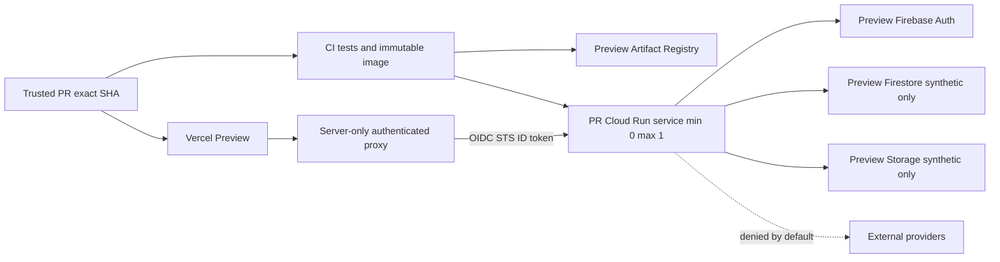

# Phase B Shared Preview Foundation Plan

> Status: planning package only. Phase B is **not authorized for implementation**.

## Purpose and evidence

Phase B would create a reusable, isolated Preview control/data plane and exact-head backend compute for authenticated QA. PR #1441 proved only the keyless identity chain: Vercel Team-issuer Preview OIDC → Google STS → exact-subject Workload Identity Federation → restricted service-account impersonation → Google ID token → IAM-protected Cloud Run. Anonymous, malformed, and wrong-audience calls failed; the spike resources were removed. It did not prove Firebase, shared fixtures, deployment automation, provider suppression, or production isolation for the application.

Facts are grounded in the repository at merge `01e3ac0a44153f3ee56b403911a9ffaefeb7931e`. Recommendations require the approvals in the [authorization checklist](phase-b-authorization-checklist.md).

## Recommended model

Use a hybrid: one permanent, isolated non-production project and shared synthetic data foundation, with immutable exact-head images and ephemeral PR-specific Cloud Run services. Vercel Preview calls a same-origin server proxy that obtains an audience-bound Google ID token. Mutable suites are serialized and namespace all fixtures by run ID. Non-mutating smoke tests may run concurrently.

This balances isolation and cost better than a permanent monolith, while avoiding the IAM, quota, cleanup, and Firebase-project sprawl of fully isolated per-PR stacks. No request may fall back to production.

## Mandatory gates

1. Assign owners, project hierarchy, billing ceiling, Terraform workspace, and emergency access.
2. Remove hard-coded production routing and project selection in separately reviewed runtime work.
3. Add explicit Preview environment identity assertions and fail-closed provider suppression.
4. Establish keyless deployment and invocation identities with separate duties.
5. Prove exact-head evidence before adding synthetic Auth/Firestore fixtures.
6. Add deterministic seed/reset/cleanup and serialized mutable QA.

## Architecture

## Ownership and change allocation

Terraform owns durable project services, identities, IAM, registries, budgets, data services, and lifecycle policy. GitHub Actions owns trusted orchestration and evidence. Cloud Build owns image construction only. Vercel owns frontend Preview deployment and issues OIDC. The application owns environment assertions, provider suppression, and safe fixture contracts. Human approval is required for applies, exceptional provider tests, destructive reset, and break-glass use.

## Cost and retention

Budget CAD 100/month; alerts at CAD 50, 80, and 100, with an operational freeze at CAD 100 pending billing-owner review. Planning estimate: CAD 0–20 idle, CAD 10–60 in a normal active month, and CAD 0.25–2.00 incremental per active PR. Retain at most three backend revisions per active PR, seven image versions total per service line for 14 days, logs seven days, run metadata 30 days, and fixtures seven days unless an approved defect hold applies.

## Rollout

Proceed only through separately authorized B0–B10 stages described in the [rollout plan](phase-b-rollout-and-acceptance-plan.md). Phase B is planning-complete but **not implementation-authorized** because ownership, Terraform Cloud authority, project choice, and application isolation changes remain unresolved.

## Proposed next mission

After executive, security, billing, Terraform, and Vercel approvals, open a separate docs-only B0 administrative-evidence mission. Do not create infrastructure until B0 evidence is approved. PR #1435 and Operational Credits remain outside this package.
