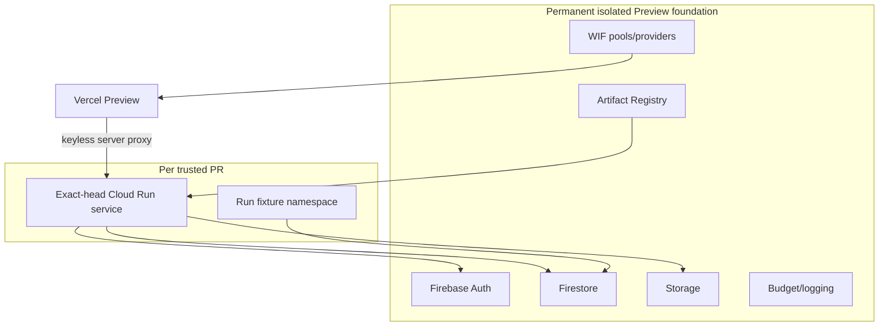

# Phase B Target Architecture

## Environment comparison

| Model | Security | Cost/complexity | Determinism/concurrency | Decision |
| --- | --- | --- | --- | --- |
| A permanent shared stack | Moderate blast radius | Lowest | Mutable conflicts | Reject as sole model. |
| B shared foundation, PR revisions | Good | Moderate | Better compute isolation | Viable. |
| C fully isolated per PR | Strongest | Highest IAM/quota/cleanup burden | Strongest | Defer until scale justifies it. |
| D shared data, ephemeral compute | Strong compute isolation; shared-data risk | Moderate | Namespace plus serialization required | **Recommended hybrid.** |

## Target topology

## Hierarchy and naming

Preferred placement is organization → non-production folder (if already available) → dedicated project → approved billing account. If folder authority is unavailable, use a directly attached dedicated project with organization policies inherited where possible and a documented exception. Never weaken organization policy merely to fit Preview.

Suggested labels: `environment=preview`, `data_class=synthetic`, `owner=engineering`, `cost_center=platform`, `lifecycle=managed`, `production_access=denied`. Suggested resources use `rc-preview-*`; PR services use `rc-preview-pr-<number>-<shortsha>`.

Do not automatically reuse the former bounded-spike project. Executive, cloud, security, billing, and Terraform owners must decide whether to adopt or create a permanent project after an inventory/import assessment.

## Isolation invariants

- Production project IDs, URLs, buckets, service accounts, credentials, data, and provider destinations are denylisted.
- Frontend, proxy, backend, and seed tooling assert one expected environment manifest.
- Backend mismatch returns unavailable; it never falls back.
- Only trusted internal PRs receive backend/fixture resources; fork and untrusted PRs receive frontend-only or no Preview.
- Shared data is synthetic, namespace-scoped, time-bounded, and never an authority for production.

## Scalability

Begin with one shared data foundation and serialized mutation lanes. Split heavy suites into per-suite namespaces before considering per-PR databases/projects. Revisit full isolation when concurrency, regulatory needs, or destructive-test volume makes serialization the dominant bottleneck.
